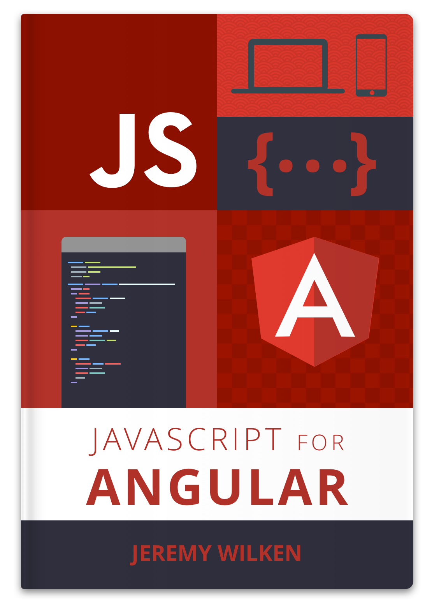

# JavaScript for Angular

**Learning Modern JavaScript for Professional Angular Applications**

The goal of this book is to teach the fundamentals of modern JavaScript and how they are used in the context of Angular applications. The book will not attempt to teach old patterns or approaches. It will focus on writing modern JavaScript.

**This book is still in initial design and planning. Feel free to submit ideas or requests at [GitHub Issues](https://github.com/gnomeontherun/javascript-for-angular/issues).**

Angular 2 introduces a completely new framework for building web applications, and much of the value rides on recent additions to the JavaScript language. Understanding how the new features of JavaScript work will greatly enhance your ability to write Angular applications. 

The JavaScript specification is known as ECMAScript, which in 2015 began a new journey where the language standardization process began a new release cycle. Essentially, new standards are regularly proposed to the official standards governing body known as TC39, and these proposals are refined over time. There are several stages for a proposal, and it may take months or years. When a proposal reaches stage four it is finally adopted and made part of the official specification.

# Contributing

**Contributions to this book are welcome.** In order to contribute, please use GitHub Issues for discussion topics and Pull Requests to submit changes. Just to be clear, your contributions are made under the license listed below, and grant me the right to maintain your contributions as part of the book.

# License & Copyright

All materials in this project are (c) 2016 Jeremy Wilken.

 This work is licensed under a <a rel="license" href="http://creativecommons.org/licenses/by-nc-nd/4.0/">Creative Commons Attribution-NonCommercial-NoDerivatives 4.0 International License</a>.
